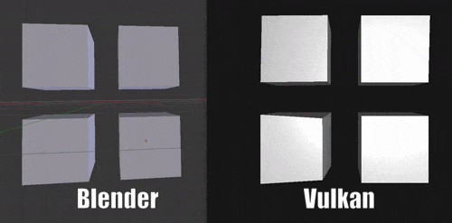

# Vulkan Morph Targets (Blend Shapes) using glTF 2.0 models



This was made to be a proof of concepts for people to reference when hacking at their own project. While almost done, there are many more part I am *activly* working on atm. **PLEASE** feel free to drop issues or PR!

- [x] Loads in glTF 2.0 Morph Target files
- [x] Dynamic shaders via SSBO and Push Constants
- [x] Specular based lighting
- [x] Get more testing models
- [x] Interpolation of timing - LINEAR, STEP, CUBICSPLINE
- [ ] Allow loading of multiple models
- [x] Allow glTF with more then 1 morph mesh
- [x] Allow glTF with more then 1 morph mesh and 1 non-morph mesh
- [ ] Allow glTF with more then 1 primative
- [ ] Allow glTF with child nodes
- [ ] UV Texture
- [ ] Materials
- [ ] Use tangents in morph

## How it works

A future blog post will be up shortly with more details of how it works so you can implement it for your own use

## Credit

Most of the template is from [Sascha Willem's Vulkan-glTF-PBR demo](https://github.com/SaschaWillems/Vulkan-glTF-PBR) so huge shout out to him! I wanted to use morph targets for my own purpose, knew [glTF had it in its specification](https://github.com/KhronosGroup/glTF/tree/master/specification/2.0#morph-targets) and decided to create a demo since no one else seems to have for Vulkan.

For info how to read in morph targets from a glTF file check out the great two tutorials from the KhronosGroup/glTF-Tutorials repo
- [Simple Morph Target](https://github.com/KhronosGroup/glTF-Tutorials/blob/master/gltfTutorial/gltfTutorial_017_SimpleMorphTarget.md)
- [Morph Targets Example](https://github.com/KhronosGroup/glTF-Tutorials/blob/master/gltfTutorial/gltfTutorial_018_MorphTargets.md)

### glTF 2.0 Model loading

Model loading and rendering is implemented in the [vkglTF::Model](./base/VulkanglTFModel.hpp) class and uses the [tiny glTF library](https://github.com/syoyo/tinygltf) to import the glTF 2.0 files.

Note that this is not a full glTF model class implementation, this was to show the steps for morph target rendering/parsing.

### The Morph data

All the `"targets"` bufferViews are found and then all the morph target data is packed in a VAO style format to a storage buffer in ther vertex shader with position then normal then tangent

```
 vec3[] = {POS_0, POS_1, POS_2, ..., POS_N}
 // or
 vec3[] = {POS_0, POS_1, ..., POS_N, NORMAL_0, NORMAL_1, ..., NORMAL_N}
 // or
 vec3[] = {POS_0, POS_1, NORMAL_0, NORMAL_1, TANGENT_0, TANGENT_1}
```

All the weights and offset are passed in via Push Constants witha max of 8 right now, can be adjusted in `morph.vert` and in `pushConstantRange.size`.

## Cloning

This repository contains submodules for some of the external dependencies, so when doing a fresh clone you need to clone recursively:

```
git clone --recursive https://github.com/sjfricke/Vulkan-glTF-Morph-Target.git
```

Updating submodules manually:

```
git submodule init
git submodule update
```

## Building

The repository contains everything required to compile and build the examples on **Windows**, **Linux** and **Android** using a C++ compiler that supports C++11. All required dependencies are included.

### Windows, Linux

Use the provided CMakeLists.txt with CMake to generate a build configuration for your favorite IDE or compiler, e.g.:

Windows:
```
cmake -G "Visual Studio 14 2015 Win64"


cd bin
Vulkan-glTF-Morph-Target.exe
```

Linux:
```
cmake .
make

cd bin
./Vulkan-glTF-Morph-Target
```

### Android 

#### Prerequisites

- [Android Studio 3.0](https://developer.android.com/studio/index.html) or higher
- Android [NDK](https://developer.android.com/ndk/downloads/index.html)
- Android API 24+

#### Building
- In Android Studio, select ```Import project```
- Select the ```android``` sub folder of the repository
- Once import has finished the project can be build, run and debugged from Android Studio

## Links
* [glTF format specification](https://github.com/KhronosGroup/glTF)
* [glTF Sample Models](https://github.com/KhronosGroup/glTF-Sample-Models)
* [tiny glTF library](https://github.com/syoyo/tinygltf)
